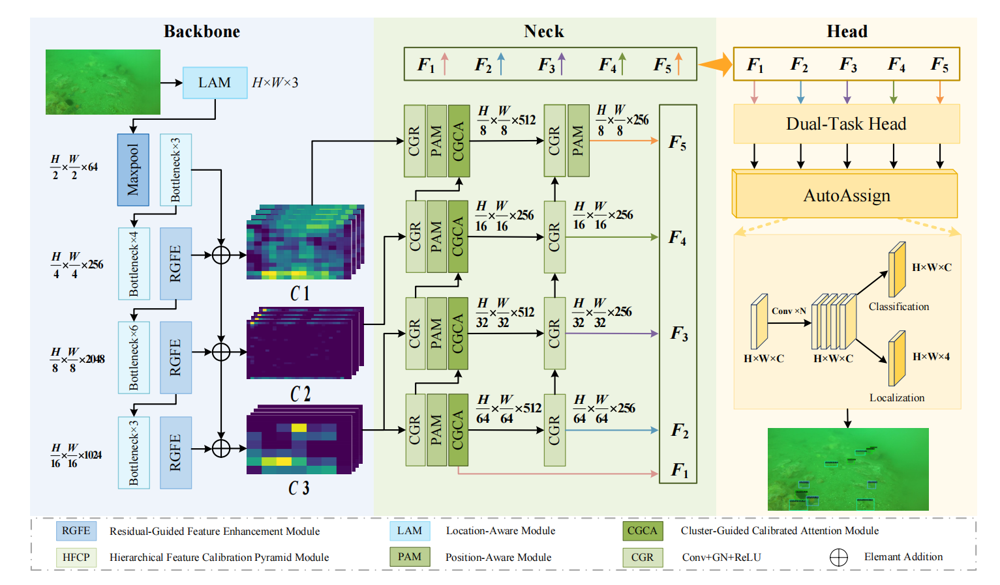
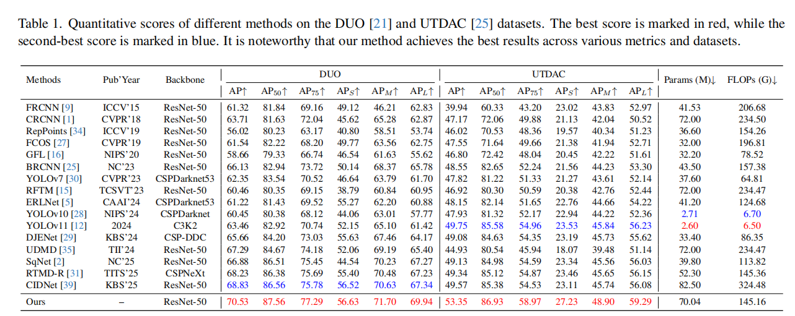
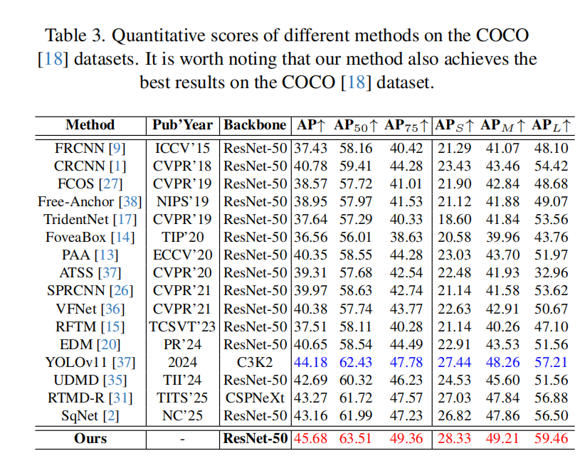

# 日期

## 2026/9/1

# 论文标题

[RHCNet: Residual-Guided Hierarchical Calibration Network for Robust Underwater Object Detection](https://openaccess.thecvf.com/content/CVPR2026/html/Wang_RHCNet_Residual-Guided_Hierarchical_Calibration_Network_for_Robust_Underwater_Object_Detection_CVPR_2026_paper.html)

# 摘要

Underwater images commonly suffer from foreground background ambiguity, loss of structural details, and severely reduced contrast, which collectively make underwater object detection (UOD) an inherently challenging task. To handle this issue, we present a residual‑guided hierarchical calibration network (RHCNet) designed to achieve more efficient and robust UOD, which comprises a residual‑guided feature enhancement module (RGFE) and a hierarchical feature calibration pyramid module (HFCP). Concretely, RHCNet extends the standard ResNet‑50 backbone by embedding the RGFE, which effectively strengthens the representation of edge and texture features in blurry regions by jointly leveraging convolutional operations and attention mechanisms to achieve more discriminative feature extraction for UOD. Subsequently, the HFCP integrates a bottom‑up semantic enhancement path and a top‑down fine‑grained feature compensation path, while a K‑means clustering–guided feature calibration module is jointly employed to ensure multi‑level cross‑scale semantic consistency and accurate alignment of salient region features. Extensive experiments on the DUO and UTDAC benchmark datasets demonstrated that our RHCNet attains the highest AP scores of 70.53% and 53.35%, respectively. Besides, our RHCNet also maintains excellent detection accuracy and strong generalization capability on the COCO dataset for terrestrial scenarios. The code is available at https://github.com/YitengGuo/RHCNet.

# 引用信息（BibTeX格式）

    @inproceedings{wang2026rhcnet,
      title={RHCNet: Residual-Guided Hierarchical Calibration Network for Robust Underwater Object Detection},
      author={Wang, Yueying and Guo, Yiteng and Zhang, Weidong and Wen, Jie and Shen, Liquan and Yan, Huaicheng and Xu, Xin},
      booktitle={Proceedings of the IEEE/CVF Conference on Computer Vision and Pattern Recognition},
      pages={4393--4402},
      year={2026}
    }

# 本论文解决什么问题

（1）边界模糊：水下光线散射会天然抑制图像高频信息，造成目标边缘模糊，纹理细节丢失等问题

（2）语义干扰：目标与背景在颜色、纹理、亮度上高度相似，目标容易被背景噪声触发误检测

（3）跨尺度错位：水下的折射、散射会导致特征空间偏移，直接融合会出现语义错位，严重影响小目标、遮挡目标的检测精度

# 已有方法的优缺点

优点：
	（1）Faster R-CNN：检测框的定位精度稳定，误检率控制能力强

​	（2）ERLNet：边缘引导表征学习，显示强化轮廓感知，缓解边界模糊问题

​	（3）DJENet：双分支联合学习，兼顾纹理与语义特征，抗背景干扰能力强

​	（4）UDMD：分心挖掘机制，主动抑制背景干扰，适配前景背景高度相似场景

​	（5）CIDNet：跨尺度干扰挖掘，提升多尺度特征一致性，检测稳定性强

缺点：

​	（1）缺乏对模糊物体区域的明确结构建模

​	（2）在严重的前景和背景干扰下，难以实现有效的语义聚焦

​	（3）多尺度特征传输过程中的对齐偏差阻碍了高效的跨尺度融合

# 本文采用什么方法及其优缺点

​	本文提出残差引导层级校准网络（RHCNet），目标是解决水下目标检测中边界模糊、前景背景混淆、多尺度特征错位的问题，本文采用 RGFE 特征增强 → HFCP 层级校准金字塔 → 双任务检测头 三步架构，配套任务自适应损失函数监督训练。

​	（1）残差引导特征增强模块（RGFE）

​	这是模型的特征提取增强部分，负责将水下模糊图像的低质量特征，恢复为包含边缘纹理细节的高判别性特征。

​		实现方法：RGFE 采用「高频提取→双路校正→残差注入」的信号恢复范式，同时搭配位置感知模块 LAM 提供早期位置先验。

​		1）：语义卷积变换（SCT）：高频结构提取

​		用深度可分离卷积显式提取图像中的边缘、梯度等高频信息，同时控制计算量。

​                 给定输入特征 $F \in \mathbb{R}^{H \times W \times C}$，输出结构先验特征：
$$
F_{SCT}=\mathcal{W}_{pw} \circledast \sigma\left(\mathcal{W}_{dw} \circledast F\right)
$$
​		其中 $\mathcal{W}_{dw}$ 为深度卷积权重，$\mathcal{W}_{pw}$ 为逐点卷积权重，$\sigma(\cdot)$ 为 ReLU 激活，$\circledast$ 表示卷积操作	

​		2）：双路径校正单元：噪声过滤与特征精细化

​		并行通道注意力与空间注意力，对高频特征做动态调制，抑制背景噪声，强化目标区域的结构特征，最终拼接得到精细化残差特征：

​		
$$
F_{RGFE}=\Phi \left( \left[ F_{SCT}\| \left(\mathcal{A}_{c}(F_{SCT})\otimes \mathcal{A}_{s}\left(F_{SCT}\right) \otimes F\right)\right]\right)
$$
​		其中 $\mathcal{A}_c(\cdot)$、$\mathcal{A}_s(\cdot)$ 分别为通道、空间注意力调制器，$\otimes$ 为逐元素相乘，$[\cdot \| \cdot]$ 为通道拼接，$\Phi(\cdot)$ 为复合映射函数。

​		3）：残差校准机制：结构信息注入语义流

​		通过上下采样匹配特征尺度，以可学习强度系数 $\lambda$ 动态控制残差权重，将恢复的结构细节融合回原始语义特征：
$$
F_{RF}=\mathcal{H}_{SCT}\left(\mathcal{D}_{\downarrow s}(F)\right) \oplus \lambda \cdot \mathcal{H}_{RGFE}\left(\mathcal{U}_{\uparrow s}\left(\mathcal{D}_{\downarrow s}(F)\right)\right)
$$
​		其中 $\mathcal{D}_{\downarrow s}(\cdot)$、$\mathcal{U}_{\uparrow s}(\cdot)$ 为空间下采样、上采样算子，$\oplus$ 为逐元素相加，$\lambda$ 为可学习强度系数。		

​	（2）层级特征校准金字塔模块（HFCP）

​	HFCP 采用双路径校准框架 + 聚类引导语义校准，实现跨尺度语义一致性与空间对齐。

​		1）：双路径校准框架

​			**自底向上语义增强路径**：从浅层到深层逐步整合通道与多尺度信息，积累全局语义，强化层级间语义一致性。

​			**自顶向下细粒度补偿路径**：通过位置感知模块（PAM），将高层全局语义作为结构模板向下投影，修正低层因遮挡导致的碎片化特征，完成空间对齐。

​		2）：聚类引导校准注意力（CGCA）：显式前景背景分离

​			CGCA 通过 K-means 构造少量全局语义原型，将像素级特征与语义原型进行匹配，从而降低传统 Non-local 像素两两关系建模的计算和噪声敏感性。

​		核心公式：
$$
\mu_{k}=\frac{1}{|c_{k}|} \sum_{F_{PA} \in c_{k}} F_{PA},\quad F_{att}=\sum_{k=1}^{K} \frac{\exp(p_{i}^{T} v_{k})}{\sum_{j=1}^{K} \exp(p_{i}^{T} v_{j})} \cdot v_{k}
$$
​	（3）任务自适应联合损失函数

 	   把最后一层的特征输入双任务检测头，分别完成分类与定位，用联合损失函数监督训练。

​	总损失由分类损失与回归损失加权组成：
$$
\mathcal{L}_{total}=\lambda_{cls} \cdot \mathcal{L}_{cls}+\lambda_{reg} \cdot \mathcal{L}_{reg}
$$
​	其中 $\lambda_{\text{cls}}=1$，$\lambda_{\text{reg}}=2$。

​		1）：分类损失：任务自适应质量焦点损失

​		引入连续质量标签（由预测 IoU 与中心度得分几何加权得到），替代传统离散二元标签，同时加入聚焦因子引导网络关注难样本：
$$
\hat{y}_i = \text{IoU}_i^{\rho} \cdot \text{Centerness}_i^{1-\rho}
$$

$$
\mathcal{L}_{cls} = -\frac{1}{N_{\text{pos}}} \sum_{i=1}^{N} \left| \hat{y}_i - p_i \right|^{\gamma} \times \left( \hat{y}_i \log(p_i) + (1-\hat{y}_i) \log(1-p_i) \right)
$$

​		2）：回归损失：GIoU 损失

​		采用广义交并比损失衡量预测框与真实框的几何一致性，提升模糊边界下的定位精度：
$$
\mathcal{L}_{\text{reg}} = \frac{1}{N_{\text{pos}}} \sum_{i=1}^{N_{\text{pos}}} \mathcal{L}_{\text{GIoU}}\left(B_{i}^{\text{pred}}, B_{i}^{\text{gt}}\right)
$$

优点：

​	（1）设计创新度高：从特征提取、多尺度融合到损失监督全流程做针对性设计，用残差引导的信号恢复思路替代传统隐式注意力，用聚类校准替代逐像素非局部注意力

​	（2）检测鲁棒性突出：在高浑浊、低能见度、目标遮挡等极端水下场景中，仍能精准锁定目标，误检、漏检率远低于对比方法，在 DUO、UTDAC 数据集上，与本文所比较的方法中，RHCNet 在 DUO 和 UTDAC 数据集上均取得最佳检测性能。

​	（3）泛化能力强：在通用自然场景数据集 COCO 上仍取得最高 AP，说明 RHCNet 不仅适用于复杂水下环境，也具有一定的跨场景泛化能力。

缺点：

​	（1）跨水域域迁移能力有限：不同浊度、光照条件的水域间仍存在固有域差距，模型在差异极大的水下环境间的泛化能力有待进一步提升。

​	（2）轻量化程度低：模型复杂度相对较高，参数量和计算量明显高于 YOLOv10、YOLOv11 等轻量化单阶段检测器，因此在资源受限设备上的实时部署仍存在压力。

​	（3）CGCA 的语义粒度可能较粗：当前采用 k=2 的 K-means 聚类，主要构建前景和背景两个语义原型。对于更加复杂的多目标场景，细粒度语义关系的建模能力可能不足

# 使用的数据集和性能度量

1、使用的数据集：

​	（1）DUO水下公开数据集（基准数据集）

​	（2）UTDAC水下公开数据集（鲁棒性验证数据集）

​	（3）COCO通用数据集（泛化性验证集）

2、性能度量：

​	（1）AP：主要性能指标，在 IoU=0.50～0.95、步长为 0.05 的多个 IoU 阈值下计算平均精度，用于衡量模型整体目标检测性能

​	（2）AP50：IoU 阈值为 0.50 时的平均精度，反映较宽松定位标准下的检测性能

​	（3）AP75：IoU 阈值为 0.75 时的平均精度，反映更严格定位标准下的检测性能。

​	（4）APS / APM / APL：别表示小目标、中目标和大目标的 AP，用于分析模型在不同目标尺度下的检测能力

# 与我们工作的相关性

（1）在目标检测中，可以参考该论文的RGFE 残差引导特征增强模块（骨干侧增强）解决边界特征退化、物体轮廓提取差的问题

（2）对于水下小目标、遮挡目标检测问题，PAM 高层语义向下修复低层特征的思路可以迁移

（3）CGCA 通过聚类区分前景背景原型，抑制背景响应，可以启发我们设计新的去噪模块。

（4）很多水下检测论文只在水下数据集测试，RHCNet 额外验证跨域泛化，可以借助这个思想在以后的研究中增加自己模型的迁移能力

# 英文总结

This paper proposes RHCNet, a residual-guided hierarchical calibration network for robust underwater object detection. It addresses challenges like foreground-background ambiguity, blurred boundaries, and low contrast. RHCNet consists of a Residual-Guided Feature Enhancement (RGFE) module to restore structural details, and a Hierarchical Feature Calibration Pyramid (HFCP) module with K-means clustering for semantic alignment and multi-scale fusion. Experiments on DUO and UTDAC datasets demonstrate that the proposed model achieves the best detection performance compared with other methods in this paper, and it also generalizes well on COCO.